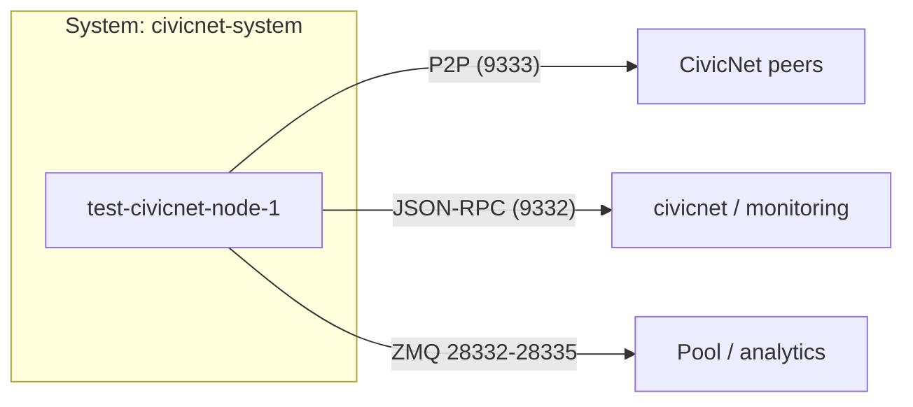

# Architecture

This page describes how the `test-civicnet-node-1` node is put together and
why. It's the mental model an operator (or platform engineer) needs before
working on the node.

## System context

The node is one component inside the **`civicnet-system`** system in the
Backstage catalog. It talks to the CivicNet peer-to-peer network (P2P), exposes a
JSON-RPC interface, and (optionally) publishes ZeroMQ events for downstream
consumers such as a pool or a monitoring stack.



!!! note
    This diagram is rendered by the **TechDocs Mermaid** integration — one of the
    features Backstage shows off.

## Repo layout

| Path | Purpose |
|------|---------|
| `src/` | Vendored upstream CivicNet source |
| `patches/` | Local source patches (applied locally + at image build) |
| `Dockerfile` | Builds the node binaries (`iotapi322/civicnet`) |
| `build.sh` | Builds the Docker image from the local tree |
| `patch.sh` | Vendors the upstream source + applies `patches/` |
| `deploy-test-civicnet-node-1.service` | systemd unit wrapping `docker run` |
| `healthcheck.sh` | Container health check (RPC or process probe) |
| `.github/workflows/build-node.yml` | CI: build + push the node image |
| `.github/workflows/techdocs.yml` | CI: build + publish this documentation |

## How the node runs

The daemon runs inside a **Docker container wrapped by systemd**. No node CLI
flags are passed on the command line — the daemon **picks up its config
automatically from its datadir** (`~/.civicnet/`). The host writes
`civicnet.conf` and it is mounted **read-only** into the container at
`/root/.civicnet/civicnet.conf`, so the daemon's default datadir lookup finds it.

Load order:

```text
systemd unit
  └─ docker run iotapi322/civicnet:$(git sha)
       └─ civicnetd
            └─ reads /root/.civicnet/civicnet.conf (mounted read-only)
```

This means configuration is **declarative and file-based**, and it follows the
standard CivicNet daemon conventions — easy for operators familiar with the
upstream project.

## Consensus model

CivicNet is a **hybrid PoW + PoS** network:

- **60-second target** block time.
- **PoS ceiling of 30%** — at most 30% of blocks can come from staking, keeping
  the chain anchored on proof-of-work.
- PoS eligibility is derived from the stake's UTXO — see
  [configuration](configuration.md) for how to enable staking on this node.
